# Farmer Assistance Platform - Complete Architecture Diagram

## System Overview
This is a comprehensive architecture diagram for the Farmer Assistance Platform backend, showing all components, data flows, external integrations, and business functionalities.

```mermaid
graph TB
    %% External Users and Systems
    subgraph "External Users & Systems"
        WEB[Web Frontend]
        MOBILE[Mobile App]
        ADMIN[Admin Dashboard]
        EXPERT[Expert Portal]
        OIDC[Asgardeo OIDC]
        WEATHER_API[Open-Meteo API]
        MARKET_API[External Market API]
        SMTP[SMTP Server]
        TWILIO[Twilio SMS]
    end

    %% Load Balancer & Security Layer
    subgraph "Security & Load Balancing"
        LB[Load Balancer]
        CORS[CORS Middleware]
        RATE[Rate Limiting]
        HELMET[Security Headers]
        AUTH_MW[Authentication Middleware]
    end

    %% Main Application Server
    subgraph "Express.js Application Server"
        subgraph "Core Server"
            SERVER[Express Server<br/>Port 5000]
            SESSION[Session Management]
            COMPRESSION[Response Compression]
            MORGAN[Request Logging]
        end

        subgraph "Route Handlers"
            AUTH_ROUTES[Authentication Routes<br/>/api/auth]
            USER_ROUTES[User Routes<br/>/api/users]
            CROP_ROUTES[Crop Routes<br/>/api/crops]
            FORUM_ROUTES[Forum Routes<br/>/api/forum]
            WEATHER_ROUTES[Weather Routes<br/>/api/weather]
            MARKET_ROUTES[Market Routes<br/>/api/market]
            NOTIF_ROUTES[Notification Routes<br/>/api/notifications]
            SUB_ROUTES[Subscription Routes<br/>/api/subscriptions]
            PLAN_ROUTES[Plan Routes<br/>/api/subscription-plans]
            PAYMENT_ROUTES[Payment Routes<br/>/api/payments]
            TRIAL_ROUTES[Trial Routes<br/>/api/trial]
            CONTACT_ROUTES[Contact Routes<br/>/api/contact]
            OIDC_ROUTES[OIDC Routes<br/>/api/oidc]
            CART_ROUTES[Cart Routes<br/>/api/cart]
            ORDER_ROUTES[Order Routes<br/>/api/orders]
            CONSULT_ROUTES[Consultation Routes<br/>/api/consultations]
            COMMUNITY_ROUTES[Community Routes<br/>/api/community]
        end

        subgraph "Controllers Layer"
            AUTH_CTRL[Auth Controller]
            USER_CTRL[User Controller]
            CROP_CTRL[Crop Controller]
            FORUM_CTRL[Forum Controller]
            WEATHER_CTRL[Weather Controller]
            MARKET_CTRL[Market Controller]
            NOTIF_CTRL[Notification Controller]
            SUB_CTRL[Subscription Controller]
            PLAN_CTRL[Plan Controller]
            PAYMENT_CTRL[Payment Controller]
            TRIAL_CTRL[Trial Controller]
            CONTACT_CTRL[Contact Controller]
            PURCHASE_CTRL[Purchase Controller]
        end

        subgraph "Services Layer"
            AUTH_SVC[Auth Service]
            EMAIL_SVC[Email Service]
            WEATHER_SVC[Weather Service]
            MARKET_SVC[Market Service]
            NOTIF_SVC[Notification Service]
            CROP_SVC[Crop Service]
            PURCHASE_SVC[Purchase Service]
        end

        subgraph "Middleware Layer"
            VALIDATE[Input Validation]
            ERROR_HANDLER[Error Handler]
            OIDC_MW[OIDC Middleware]
            SECURITY_MW[Security Middleware]
            AUDIT[Audit Logger]
        end
    end

    %% Database Layer
    subgraph "MongoDB Database"
        subgraph "User Management"
            USER_COLL[Users Collection]
            TRIAL_COLL[Trials Collection]
            CONTACT_COLL[Contacts Collection]
            SUBSCRIBER_COLL[Subscribers Collection]
        end

        subgraph "Core Business Data"
            CROP_COLL[Crops Collection]
            FORUM_COLL[Forum Collection]
            MARKET_COLL[Market Collection]
            WEATHER_COLL[Weather Collection]
            NOTIF_COLL[Notifications Collection]
        end

        subgraph "Subscription & Payment"
            PLAN_COLL[Subscription Plans]
            SUB_COLL[Subscriptions]
            PAYMENT_COLL[Payments]
            PAYMENT_METHOD_COLL[Payment Methods]
            PURCHASE_COLL[Purchases]
        end
    end

    %% External Integrations
    subgraph "External Services Integration"
        subgraph "Communication"
            EMAIL_INT[Email Integration<br/>Nodemailer]
            SMS_INT[SMS Integration<br/>Twilio]
        end

        subgraph "Authentication"
            JWT_INT[JWT Token Management]
            OIDC_INT[OIDC Integration<br/>Asgardeo]
        end

        subgraph "Data Sources"
            WEATHER_INT[Weather Data<br/>Open-Meteo]
            MARKET_INT[Market Data<br/>External APIs]
        end
    end

    %% Utilities & Logging
    subgraph "Utilities & Monitoring"
        LOGGER[Winston Logger]
        AUDIT_LOG[Audit Logger]
        CONSTANTS[Constants]
        LOGS[Log Files<br/>combined.log<br/>error.log]
    end

    %% Data Flow Connections
    WEB --> LB
    MOBILE --> LB
    ADMIN --> LB
    EXPERT --> LB

    LB --> CORS
    CORS --> RATE
    RATE --> HELMET
    HELMET --> AUTH_MW
    AUTH_MW --> SERVER

    SERVER --> SESSION
    SERVER --> COMPRESSION
    SERVER --> MORGAN

    %% Route to Controller connections
    AUTH_ROUTES --> AUTH_CTRL
    USER_ROUTES --> USER_CTRL
    CROP_ROUTES --> CROP_CTRL
    FORUM_ROUTES --> FORUM_CTRL
    WEATHER_ROUTES --> WEATHER_CTRL
    MARKET_ROUTES --> MARKET_CTRL
    NOTIF_ROUTES --> NOTIF_CTRL
    SUB_ROUTES --> SUB_CTRL
    PLAN_ROUTES --> PLAN_CTRL
    PAYMENT_ROUTES --> PAYMENT_CTRL
    TRIAL_ROUTES --> TRIAL_CTRL
    CONTACT_ROUTES --> CONTACT_CTRL
    OIDC_ROUTES --> AUTH_CTRL
    CART_ROUTES --> USER_CTRL
    ORDER_ROUTES --> PURCHASE_CTRL
    CONSULT_ROUTES --> FORUM_CTRL
    COMMUNITY_ROUTES --> FORUM_CTRL

    %% Controller to Service connections
    AUTH_CTRL --> AUTH_SVC
    AUTH_CTRL --> EMAIL_SVC
    WEATHER_CTRL --> WEATHER_SVC
    MARKET_CTRL --> MARKET_SVC
    NOTIF_CTRL --> NOTIF_SVC
    CROP_CTRL --> CROP_SVC
    PURCHASE_CTRL --> PURCHASE_SVC

    %% Service to External connections
    EMAIL_SVC --> EMAIL_INT
    NOTIF_SVC --> SMS_INT
    WEATHER_SVC --> WEATHER_INT
    MARKET_SVC --> MARKET_INT
    AUTH_SVC --> JWT_INT
    AUTH_SVC --> OIDC_INT

    %% Database connections
    AUTH_CTRL --> USER_COLL
    AUTH_CTRL --> TRIAL_COLL
    USER_CTRL --> USER_COLL
    CROP_CTRL --> CROP_COLL
    FORUM_CTRL --> FORUM_COLL
    WEATHER_CTRL --> WEATHER_COLL
    MARKET_CTRL --> MARKET_COLL
    NOTIF_CTRL --> NOTIF_COLL
    SUB_CTRL --> SUB_COLL
    PLAN_CTRL --> PLAN_COLL
    PAYMENT_CTRL --> PAYMENT_COLL
    PAYMENT_CTRL --> PAYMENT_METHOD_COLL
    PURCHASE_CTRL --> PURCHASE_COLL
    CONTACT_CTRL --> CONTACT_COLL
    TRIAL_CTRL --> TRIAL_COLL

    %% External API connections
    WEATHER_INT --> WEATHER_API
    MARKET_INT --> MARKET_API
    EMAIL_INT --> SMTP
    SMS_INT --> TWILIO
    OIDC_INT --> OIDC

    %% Utility connections
    SERVER --> LOGGER
    AUTH_MW --> AUDIT_LOG
    LOGGER --> LOGS
    AUDIT_LOG --> LOGS

    %% Styling
    classDef userLayer fill:#e1f5fe
    classDef securityLayer fill:#fff3e0
    classDef appLayer fill:#f3e5f5
    classDef dataLayer fill:#e8f5e8
    classDef externalLayer fill:#fce4ec
    classDef utilLayer fill:#f5f5f5

    class WEB,MOBILE,ADMIN,EXPERT userLayer
    class LB,CORS,RATE,HELMET,AUTH_MW securityLayer
    class SERVER,SESSION,COMPRESSION,MORGAN,AUTH_ROUTES,USER_ROUTES,CROP_ROUTES,FORUM_ROUTES,WEATHER_ROUTES,MARKET_ROUTES,NOTIF_ROUTES,SUB_ROUTES,PLAN_ROUTES,PAYMENT_ROUTES,TRIAL_ROUTES,CONTACT_ROUTES,OIDC_ROUTES,CART_ROUTES,ORDER_ROUTES,CONSULT_ROUTES,COMMUNITY_ROUTES,AUTH_CTRL,USER_CTRL,CROP_CTRL,FORUM_CTRL,WEATHER_CTRL,MARKET_CTRL,NOTIF_CTRL,SUB_CTRL,PLAN_CTRL,PAYMENT_CTRL,TRIAL_CTRL,CONTACT_CTRL,PURCHASE_CTRL,AUTH_SVC,EMAIL_SVC,WEATHER_SVC,MARKET_SVC,NOTIF_SVC,CROP_SVC,PURCHASE_SVC,VALIDATE,ERROR_HANDLER,OIDC_MW,SECURITY_MW,AUDIT appLayer
    class USER_COLL,TRIAL_COLL,CONTACT_COLL,SUBSCRIBER_COLL,CROP_COLL,FORUM_COLL,MARKET_COLL,WEATHER_COLL,NOTIF_COLL,PLAN_COLL,SUB_COLL,PAYMENT_COLL,PAYMENT_METHOD_COLL,PURCHASE_COLL dataLayer
    class OIDC,WEATHER_API,MARKET_API,SMTP,TWILIO,EMAIL_INT,SMS_INT,JWT_INT,OIDC_INT,WEATHER_INT,MARKET_INT externalLayer
    class LOGGER,AUDIT_LOG,CONSTANTS,LOGS utilLayer
```

## Key Features & Functionalities

### 🔐 Authentication & Authorization
- **JWT-based Authentication** with role-based access control
- **OIDC Integration** with Asgardeo for enterprise SSO
- **User Roles**: Farmer, Expert, Admin
- **Email Verification** and password reset functionality
- **Trial Registration** system for new users

### 🌾 Core Agricultural Features
- **Crop Management**: CRUD operations for crop tracking
- **Weather Monitoring**: Real-time weather data from Open-Meteo API
- **Market Information**: Price tracking and market data
- **Forum System**: Community discussions and expert advice
- **Expert Consultation**: Direct access to agricultural experts

### 💳 Subscription & Payment System
- **Multiple Subscription Plans**: Basic, Premium, Enterprise, Custom
- **Payment Methods**: Credit cards, PayPal, bank transfers, crypto
- **Trial Management**: 14-day free trials with feature limitations
- **Billing Cycles**: Monthly, quarterly, yearly, lifetime
- **Payment Processing**: Integration with Stripe, PayPal, Razorpay

### 📱 Communication & Notifications
- **Multi-channel Notifications**: Email, SMS, Push notifications
- **Email Service**: Automated emails for verification, notifications
- **SMS Integration**: Twilio integration for SMS alerts
- **Contact Management**: Customer support and inquiry handling

### 🛡️ Security & Monitoring
- **Comprehensive Security**: Helmet, CORS, rate limiting, input validation
- **Audit Logging**: Complete audit trail for security events
- **Error Handling**: Centralized error management and logging
- **Data Validation**: Input sanitization and validation
- **Session Management**: Secure session handling

### 📊 Data Management
- **MongoDB Database**: Scalable NoSQL database
- **Data Models**: 13+ optimized data models with relationships
- **Caching**: Weather data caching for performance
- **Data Integrity**: Referential integrity and validation

### 🔧 Technical Architecture
- **Express.js Framework**: RESTful API design
- **Modular Structure**: Controllers, Services, Models, Middleware
- **Environment Configuration**: Comprehensive environment variable management
- **Logging System**: Winston-based structured logging
- **API Documentation**: Postman collections and guides

## API Endpoints Summary

### Core APIs (25+ endpoints)
- **Authentication**: `/api/auth/*` (6 endpoints)
- **User Management**: `/api/users/*` (4 endpoints)
- **Crop Management**: `/api/crops/*` (5 endpoints)
- **Forum System**: `/api/forum/*` (6 endpoints)
- **Weather Data**: `/api/weather/*` (3 endpoints)
- **Market Data**: `/api/market/*` (4 endpoints)
- **Notifications**: `/api/notifications/*` (4 endpoints)

### Subscription & Payment APIs (15+ endpoints)
- **Subscription Plans**: `/api/subscription-plans/*` (5 endpoints)
- **Subscriptions**: `/api/subscriptions/*` (7 endpoints)
- **Payments**: `/api/payments/*` (8 endpoints)
- **Payment Methods**: `/api/payments/methods/*` (4 endpoints)

### Additional APIs (10+ endpoints)
- **Trial Management**: `/api/trial/*` (3 endpoints)
- **Contact Support**: `/api/contact/*` (2 endpoints)
- **OIDC Integration**: `/api/oidc/*` (4 endpoints)
- **Shopping Cart**: `/api/cart/*` (4 endpoints)
- **Orders**: `/api/orders/*` (5 endpoints)
- **Consultations**: `/api/consultations/*` (3 endpoints)
- **Community**: `/api/community/*` (3 endpoints)

## Technology Stack

### Backend Framework
- **Node.js 18+** with Express.js 5.1.0
- **MongoDB 6+** with Mongoose ODM
- **JWT** for authentication
- **bcryptjs** for password hashing

### External Integrations
- **Open-Meteo API** for weather data
- **Twilio** for SMS notifications
- **Nodemailer** for email services
- **Asgardeo OIDC** for enterprise authentication

### Security & Middleware
- **Helmet** for security headers
- **CORS** for cross-origin requests
- **express-rate-limit** for rate limiting
- **express-validator** for input validation
- **express-session** for session management

### Development & Monitoring
- **Winston** for logging
- **Morgan** for HTTP request logging
- **Nodemon** for development
- **Compression** for response optimization

This architecture supports a comprehensive farmer assistance platform with robust security, scalable design, and extensive agricultural management features.
